# Reconstruction and Visualisation Skill

A [Claude Skill](https://support.claude.com/en/articles/12512180-using-skills-in-claude) that turns source
material (a messy doc, a data dump, an old report or deck) into a new document shaped by **who will read it and
what they need to do with it**: a real narrative arc, and a chart, table or plain paragraph chosen for what each
piece of content actually is, rather than reformatting.

It works as one continuous conversation, not a pipeline. It asks a fixed set of intake questions, proposes two real
story arcs for you to choose between, shows you a plan and a cut list before drafting, audits its own draft against
the source, and only then builds the file.

**Outputs:** conventional document (`.docx`), visual report (print-ready `.html`), interactive document (`.html`),
or presentation (`.pptx`), plus a companion note recording every decision, cut and known gap.

## Install

**Claude app (claude.ai, desktop, mobile)** — [download the latest `.skill` file](https://github.com/virapandy/reconstruction-and-visualisation-skill-dist/releases/latest/download/reconstruction-and-visualisation-skill.skill),
then Settings → Capabilities → Skills → upload it, and click **Save skill**. Turn on **Code execution and file
creation** in Settings → Capabilities: the skill's checks are Python scripts, and without code execution it runs on
written rules alone and says so in the run header.

**Claude Code** — unzip the same file into your skills directory (a `.skill` is a zip archive):

```bash
mkdir -p ~/.claude/skills/reconstruction-and-visualisation-skill
unzip reconstruction-and-visualisation-skill.skill -d ~/.claude/skills/reconstruction-and-visualisation-skill
```

Then describe what you want ("restructure this report for the board", "turn this dump into a deck") or invoke it by
name. Only the latest version is published here; re-uploading the file replaces an installed copy.

## What makes it different

- **Confirmation gates, not silent choices.** You approve the story arc, the plan, and the cut list (every source
  heading is carried as a visual, carried as prose, or explicitly not carried) before anything is built.
- **Enforced by scripts, not only by instructions.** A work log refuses out-of-order steps, fabricated quotations,
  unread references and false "done" claims; a checker inspects the built file. Refusals teach: each one says what to
  do instead.
- **A closed icon system.** Evidence-source, status and callout icons ship as a fixed sprite and are checked to be
  byte-identical, so they are never improvised. Icons mark *where a claim comes from*, never how well it is
  validated.
- **Works inside claude.ai chat.** Runtime scripts use only the Python standard library and need no network.

## The flow

Gold = waiting on you. Green = Claude doing the work. Steps 1, 3, 5, 6, 8
and 9 block everything downstream until you respond — step 1 is the full
intake conversation, several questions, not one. Step 9 also asks a
question, but only after delivery has already happened, so it doesn't
block anything upstream the way the other five do. Step 6's 6a
challenge, run right after the cut list is confirmed and before drafting
starts, sends its own notice when it changes something, but that notice
doesn't block either — it's a disclosure about a representation choice,
not a decision the reader needs to approve. Step 0 runs silently before
any of this — it's what makes the rest of the skill's own instructions
readable in full rather than silently truncated, and resumable if the
job's context ever breaks.

```mermaid
flowchart TD
    S0["<b>0 · Work log</b><br/>New job: create it from the template<br/>Resumed job: read Section A, confirm the brief with you before acting on it"]:::claude
    S1["<b>1 · Ask</b><br/>Purpose · audience + what they already know + what they need from it · how visual · output format (conventional .docx / visual report .html / interactive .html / presentation) · what must stay or go"]:::you
    S2["<b>2 · Read &amp; Propose</b><br/>Reads the whole source once<br/>Writes two real candidate story arcs, as full passages"]:::claude
    S3["<b>3 · Confirm the Story</b><br/>You pick one arc"]:::you
    S4["<b>4 · Plan It Out</b><br/>Index as an interactive artifact, full rows and columns, hierarchical numbering (2.1, 2.2 inside Part 2)<br/>Primary, all-tests-no, promoted/reframed/ambiguous rows marked; a summary strip up top; every verdict one click from its full sentence"]:::claude
    S5["<b>5 · Confirm the Plan</b><br/>You approve the index before anything is drafted"]:::you
    S6["<b>6 · Confirm the Cut List</b><br/>Every source heading gets one of three states — carried with a visual, carried as prose, not carried<br/>Its own step, its own confirmation<br/>Then the 6a challenge re-examines a handful of suspicious verdicts before Phase 2 starts, sending a non-blocking notice if anything changed"]:::you
    S7["<b>7 · Draft + Self-Audit</b><br/>Writes the full document, then checks facts, rendering and cuts against the source"]:::claude
    S8["<b>8 · Confirm Build &amp; Classification</b><br/>Shows the completed index, the Build Sheet, and the Reference Disposition Table — every design reference accounted for, none silently skipped<br/>You confirm before the final file is generated"]:::you
    S9["<b>9 · Delivered</b><br/>The document (plus its PDF export, for HTML formats) and a companion note<br/>Always explicitly asks: one more independent pass against the source, or ship as-is?"]:::you
    S10["<b>10 · Learn</b><br/>Names what was new or reworked this run<br/>Asks whether to fold it into the skill"]:::claude

    S0 --> S1 --> S2 --> S3 --> S4 --> S5 --> S6 --> S7 --> S8 --> S9 --> S10

    classDef you fill:#f6ecc9,stroke:#8a6d1f,stroke-width:2px,color:#1c2b39
    classDef claude fill:#dcece5,stroke:#3d6b5c,stroke-width:2px,color:#1c2b39
```



### Step by step

| Step | Who acts | What happens |
|---|---|---|
| 0 · Work log | Claude, silently | `SKILL.md` is a thin bootstrap; Phase 0–3 content lives in seven numbered spine files (00–06), each read just-in-time. A work log (`references/work-log-template.md`) tracks what's been read and decided. On a resumed job, this step reads it and confirms the brief with you before continuing. |
| 1 · Ask | You answer | One question per message, waiting for each answer (three narrow pairing exceptions live in spine-01): purpose; audience plus what they already know and specifically need; how visual (you set intensity, the skill decides what gets visualised); traceability level; output format — conventional document (.docx), visual report (.html, print-ready), interactive document (.html), or presentation (.pptx) — asked explicitly, never inferred from the source; anything to keep or cut. |
| 2 · Read & Propose | Claude drafts | Reads the entire source once. Writes two real, different tellings of the story — full paragraphs, checked against what the source can support. |
| 3 · Confirm the Story | You decide | Pick one arc, or ask for a blend. |
| 4 · Plan It Out | Claude drafts | An interactive index, every row classified, hierarchical Part-scoped numbering (2.1 inside Part 2). Each row carries a verdict per representation family ("No — because…"). |
| 5 · Confirm the Plan | You decide | Approve the index, or redirect it — cheap now, expensive after charts are built. |
| 6 · Confirm the Cut List | You decide | Every source heading gets one of three states — visual, prose, or not carried — built from the source's own heading list. The 6a challenge then re-examines a handful of suspicious verdicts before drafting, sending a non-blocking notice if anything changed. |
| 7 · Draft + Self-Audit | Claude drafts | Writes the document, then checks its own work: numbers against source, rendering, cuts against step 6's list. |
| 8 · Confirm Build & Classification | You decide | The index, the Build Sheet, and the Reference Disposition Table (every governing reference logged used-with-evidence or not-triggered-with-a-reason) shown together. A hard stop — the file isn't generated until you confirm. |
| 9 · Delivered | You decide | The deliverable plus its PDF export (HTML formats) and a companion note. Always asks: one more independent pass against the source, or ship as-is? |
| 10 · Learn | Claude proposes, you approve | Names what was genuinely new or went wrong, asks whether it becomes a standing rule. |

## Feedback

At the end of a job the skill offers to send a **content-free run report**: counts, check IDs with pass/fail, which
skill files were read, and your Python version and OS. It contains none of your source, headings, figures or answers,
is built by a script, and is shown to you in full before anything is sent; nothing leaves until you press send.

- Email: feedback.rv@gmail.com
- Issues: [reconstruction-and-visualisation-skill-feedback](https://github.com/virapandy/reconstruction-and-visualisation-skill-feedback/issues)

## Licence

[MIT](LICENSE): free to use, change, redistribute and build on, including commercially, as long as the copyright
notice and licence text stay with copies. Icons are from [Tabler Icons](https://tabler.io/icons) (MIT) and
[Health Icons](https://healthicons.org) (MIT); their notices are inside the package at
`assets/icons/THIRD-PARTY-NOTICES.md`.
