# Reconstruction and Visualisation Skill

A [Claude Skill](https://support.claude.com/en/articles/12512180-using-skills-in-claude) that turns source
material (a messy doc, a data dump, an old report or deck) into a new document shaped by **who will read it and
what they need to do with it**: a real narrative arc, and a chart, table or plain paragraph chosen for what each
piece of content actually is, rather than reformatting. True to the source, with scripted safeguards against
invented content and overclaiming.

It works as one continuous conversation, not a pipeline. It asks a fixed set of intake questions, proposes two real
story arcs for you to choose between, shows you a plan and a cut list before drafting, audits its own draft against
the source, and only then builds the file.

**Outputs:** conventional report (Word), digital report (HTML, online-publication style, with a PDF copy), print report
(magazine or newsprint pages, PDF), or presentation (Claude Slides, downloadable as `.pptx` or PDF), all generated on
request from one working Claude Doc, plus a companion note recording every decision, cut and known gap.

## Install

**Claude app (claude.ai, desktop, mobile)** — [download the latest `.skill` file](https://github.com/virapandy/reconstruction-and-visualisation-skill/releases/latest/download/reconstruction-and-visualisation-skill.skill),
then Settings → Capabilities → Skills → upload it, and click **Save skill**. Turn on **Code execution and file
creation** in Settings → Capabilities: the skill's checks are Python scripts, and without code execution it runs on
written rules alone and says so in the run header.

**Claude Code** — unzip the same file into your skills directory (a `.skill` is a zip archive):

```bash
mkdir -p ~/.claude/skills/reconstruction-and-visualisation-skill
unzip reconstruction-and-visualisation-skill.skill -d ~/.claude/skills/reconstruction-and-visualisation-skill
```

Then describe what you want ("restructure this report for the board", "turn this dump into a deck") or invoke it by
name. Only the latest version is published here.

**Updating** — download the file again and re-upload it: the new version replaces the installed one, and earlier
versions stay in the skill's version history. The skill itself tells you, in one line at the start of a job, when a
newer release is published here.

## What makes it different

- **Confirmation gates, not silent choices.** You approve the story arc, the plan, and the cut list (every source
  heading is carried as a visual, carried as prose, or explicitly not carried) before anything is built.
- **Story before visuals, and decks made of exhibits.** Every job confirms a one-sentence big idea and voice-tests the
  storyline (the hero points read alone, as the reader, with no visuals) before any visual is chosen. A deck is planned
  as a slide-by-slide storyboard, shown as a grey-box light table, in which every main slide is a claim title plus one
  exhibit; a text-only slide is refused, and the built deck is checked against the confirmed storyboard.
- **One working Doc, outputs on request.** All the content lives in a Claude Doc you can comment on and edit. Each
  output is generated from it when you ask; come back later, change the Doc, and regenerate only what changed.
- **It looks at its own output.** Every build is rendered and looked at, page by page or at phone and laptop widths,
  before you see it. The look checks claims as well as layout: a rendered grid can show that a distinction the prose
  made is not in the evidence.
- **One chart kit for every medium.** A shared registry of chart and diagram shapes, each drawn from one data spec by
  the report kit and the Slides kit alike, with one number format and layouts that hold on a phone.
- **Enforced by scripts, not only by instructions.** A work log refuses out-of-order steps, fabricated quotations,
  unread references (a build is refused until its references are read in full) and false "done" claims; a checker
  inspects the built file. Refusals teach: each one says what to do instead.
- **Honest about what can't be enforced.** The skill's guarantee table (in `SKILL.md`) separates what is blocked,
  what is verified by a script, and what remains the model's own claim. Nothing there is described as stronger than
  it is.
- **A closed icon system.** Evidence-source, status and callout icons ship as a fixed sprite and are checked to be
  byte-identical, so they are never improvised. Icons mark *where a claim comes from*, never how well it is
  validated.
- **Works inside claude.ai chat.** Runtime scripts are Python standard library only (3.9+ syntax). The one network
  request is the optional version check: an ordinary HTTPS request to github.com that sends nothing about your job
  (GitHub sees your IP address, as with any page visit). With no network it is skipped silently.
- **Tells you when it is out of date.** At the start of a job it checks the latest release here once and, if you are
  behind, shows one line with the download link. It never updates itself and never blocks the job.

## The flow

Gold = waiting on you. Green = Claude doing the work. Steps 1, 3, 5, 6, 8
and 9 block everything downstream until you respond — step 1 is the full
intake conversation, several questions, not one. Step 9 also asks a
question, but only after delivery has already happened, so it doesn't
block anything upstream the way the other five do. Step 6's 6a
challenge, run right after the cut list is confirmed and before drafting
starts, sends its own notice when it changes something, but that notice
doesn't block either — it's a disclosure about a representation choice,
not a decision the reader needs to approve. Step 0 runs silently before
any of this — it's what makes the rest of the skill's own instructions
readable in full rather than silently truncated, and resumable if the
job's context ever breaks.

```mermaid
flowchart TD
    S0["<b>0 · Work log + version check</b><br/>New job: create the log, and check once whether a newer version of this skill is published (one line if so; never blocks)<br/>Resumed job: read Section A, confirm the brief with you before acting on it"]:::claude
    S1["<b>1 · Ask</b><br/>Purpose · audience + what they already know + what they need from it · how visual · output format (conventional report in Word / digital report / print report / presentation) · what must stay or go"]:::you
    S2["<b>2 · Read &amp; Propose</b><br/>Reads the whole source once<br/>Writes two real candidate story arcs, as full passages, each opening with its big idea"]:::claude
    S3["<b>3 · Confirm the Story</b><br/>You pick one arc"]:::you
    S4["<b>4 · Plan It Out</b><br/>Storyline first: the hero points in order, voice-tested with no visuals<br/>Then the index as an interactive artifact that reads as a storyboard (a deck: a slide-by-slide storyboard and grey-box light table, every main slide one exhibit), full rows and columns, hierarchical numbering (2.1, 2.2 inside Part 2)<br/>Primary, all-tests-no, promoted/reframed/ambiguous rows marked; a summary strip up top; every verdict one click from its full sentence"]:::claude
    S5["<b>5 · Confirm the Plan</b><br/>You approve the index before anything is drafted"]:::you
    S6["<b>6 · Confirm the Cut List</b><br/>Every source heading gets one of three states — carried with a visual, carried as prose, not carried<br/>Its own step, its own confirmation<br/>Then the 6a challenge re-examines a handful of suspicious verdicts before Phase 2 starts, sending a non-blocking notice if anything changed"]:::you
    S7["<b>7 · Draft, Generate, Look</b><br/>Writes the content into a working Claude Doc you can comment on, then generates the chosen output from it with the design kit<br/>Renders it and looks at every page or width, fixing the layout and any claim the picture shows is not supported; then checks numbers and cuts against the source"]:::claude
    S8["<b>8 · Confirm Build &amp; Classification</b><br/>Shows the completed index, the Build Sheet, and the Reference Disposition Table — every design reference accounted for, none silently skipped<br/>You confirm before the final file is generated"]:::you
    S9["<b>9 · Delivered</b><br/>The output (plus its PDF for the digital and print reports) and a companion note<br/>Always explicitly asks: one more independent pass against the source, or ship as-is?<br/>Come back any day: edit the Doc and ask to regenerate"]:::you
    S10["<b>10 · Learn</b><br/>Names what was new or reworked this run<br/>Asks for your improvements, then offers to send a content-free run report"]:::claude

    S0 --> S1 --> S2 --> S3 --> S4 --> S5 --> S6 --> S7 --> S8 --> S9 --> S10

    classDef you fill:#f6ecc9,stroke:#8a6d1f,stroke-width:2px,color:#1c2b39
    classDef claude fill:#dcece5,stroke:#3d6b5c,stroke-width:2px,color:#1c2b39
```



### Step by step

| Step | Who acts | What happens |
|---|---|---|
| 0 · Work log + version check | Claude, silently | `SKILL.md` is a thin bootstrap; Phase 0–3 content lives in seven numbered spine files (00–06), each read just-in-time. A work log (`references/work-log-template.md`) tracks what's been read and decided. A new job first checks, once, whether a newer version of the skill is published; if so you see one line with the download link, and the job carries on either way. On a resumed job, this step reads the log and confirms the brief with you before continuing. |
| 1 · Ask | You answer | One question per message, waiting for each answer (three narrow pairing exceptions live in spine-01): purpose; audience plus what they already know, believe and will object to (the persona is derived from it and stated back); how visual (you set intensity, the skill decides what gets visualised); traceability level; output format — conventional report (Word), digital report (online-publication style), print report (magazine or newsprint pages, PDF), or presentation (Claude Slides, .pptx export); all work happens in a working Claude Doc and each output is generated from it on request — asked explicitly, never inferred from the source; anything to keep or cut. |
| 2 · Read & Propose | Claude drafts | Reads the entire source once. Writes two real, different tellings of the story — full paragraphs, each opening with its big idea (a point of view plus what is at stake), checked against what the source can support. |
| 3 · Confirm the Story | You decide | Pick one arc, or ask for a blend. |
| 4 · Plan It Out | Claude drafts | First the storyline: one sentence per row, in order, read alone as the persona with no visuals — the index is refused until it holds. Then an interactive index that reads as a storyboard (claim, what is said, what is shown), every row classified, hierarchical Part-scoped numbering (2.1 inside Part 2). Each row carries a verdict per representation family ("No — because…"). In a deck the rows are slides and the plan is also `storyboard.json`: every main slide an action title plus one exhibit, checked by script and shown as a grey-box light table before any design. |
| 5 · Confirm the Plan | You decide | Approve the index, or redirect it — cheap now, expensive after charts are built. |
| 6 · Confirm the Cut List | You decide | Every source heading gets one of three states — visual, prose, or not carried — built from the source's own heading list. The 6a challenge then re-examines a handful of suspicious verdicts before drafting, sending a non-blocking notice if anything changed. |
| 7 · Draft, Generate, Look | Claude drafts | Writes the content into the working Claude Doc (you can comment and edit there any time), then generates the chosen output from it with the design kit, after reading the generation references in full (the work log refuses a build until they are). It renders the output and looks at every page or width, fixing the layout and any claim the rendered picture shows the evidence does not support, then checks numbers against the source and cuts against step 6's list. |
| 8 · Confirm Build & Classification | You decide | The index, the Build Sheet, and the Reference Disposition Table (every governing reference logged used-with-evidence or not-triggered-with-a-reason) shown together. A hard stop — the file isn't generated until you confirm. |
| 9 · Delivered | You decide | The output (plus its PDF for the digital and print reports) and a companion note. Always asks: one more independent pass against the source, or ship as-is? Come back any day, edit the Doc, and ask to regenerate: incremental (keeps the design, rebuilds what changed) or fresh (a new take, about the cost of a first build). |
| 10 · Learn | You decide | Names what was genuinely new or went wrong, asks for your improvements to the skill, then offers to send a content-free run report (shown in full first; nothing goes until you press send). |

## Feedback

At the end of a job the skill offers to send a **content-free run report**: counts, check IDs with pass/fail, which
skill files were read, and your Python version and OS. It contains none of your source, headings, figures or answers,
is built by a script, and is shown to you in full before anything is sent; nothing leaves until you press send.

- Email: feedback.rv@gmail.com
- Issues: [reconstruction-and-visualisation-skill-feedback](https://github.com/virapandy/reconstruction-and-visualisation-skill-feedback/issues)

## Licence

[MIT](LICENSE): free to use, change, redistribute and build on, including commercially, as long as the copyright
notice and licence text stay with copies. Icons are from [Tabler Icons](https://tabler.io/icons) (MIT) and
[Health Icons](https://healthicons.org) (MIT); their notices are inside the package at
`assets/icons/THIRD-PARTY-NOTICES.md`. The `livestock-market` icons are original to this package. The kit typefaces,
Newsreader and IBM Plex Sans Condensed, are under the SIL Open Font License (`assets/kits/fonts/OFL.txt`).
